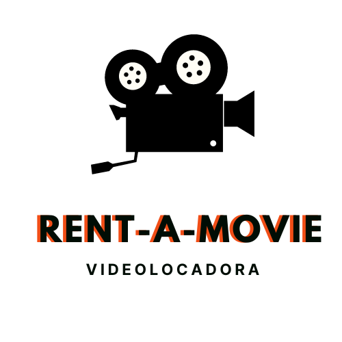

# Rent-a-Movie

<!-- PROJECT LOGO -->
<br />
<div align="center">
  <a href="https://github.com/hnralmeida/rentamovie">
    
  </a>

  <h3 align="center">Projeto de Sistema da Locadora</h3>

  <p align="center">
    Projeto de informatização de uma locadora de vídeos  com base em especificação prévia de diagramas de classess, atores e calsses utilizadas.
    <br />
    <a href="https://github.com/hnralmeida/project.rent-a-movie"><strong>Explore the docs »</strong></a>
    <br />
    <br />
    <a href="https://github.com/hnralmeida/project.rent-a-movie">View Demo</a>
    ·
    <a href="https://github.com/hnralmeida/project.rent-a-movie/issues">Report Bug</a>
    ·
    <a href="https://github.com/hnralmeida/project.rent-a-movie/issues">Request Feature</a>
  </p>
</div>


<!-- TABLE OF CONTENTS -->
<details>
  <summary>Table of Contents</summary>
  <ol>
    <li>
      <a href="#about-the-project">About The Project</a>
      <ul>
        <li><a href="#built-with">Built With</a></li>
      </ul>
    </li>
    <li>
      <a href="#getting-started">Getting Started</a>
      <ul>
        <li><a href="#prerequisites">Prerequisites</a></li>
        <li><a href="#installation">Installation</a></li>
      </ul>
    </li>
    <li><a href="#usage">Usage</a></li>
    <li><a href="#roadmap">Roadmap</a></li>
    <li><a href="#contributing">Contributing</a></li>
    <li><a href="#license">License</a></li>
    <li><a href="#contact">Contact</a></li>
    <li><a href="#acknowledgments">Acknowledgments</a></li>
  </ol>
</details>


<!-- ABOUT THE PROJECT -->
## About The Project

[![Product Name Screen Shot][product-screenshot]](https://example.com)

CRM example built with React, authentication with firebase. The id is from the author, open an issue if there's any problem with that.

<p align="right">(<a href="#readme-top">back to top</a>)</p>


### Built With

This section should list any major frameworks/libraries used to bootstrap your project. Leave any add-ons/plugins for the acknowledgements section. Here are a few examples.

[![React][React.js]](https://reactjs.org/)
[![Vite][Vite.js]](https://vitejs.dev/)

<p align="right">(<a href="#readme-top">back to top</a>)</p>


<!-- GETTING STARTED -->
## Getting Started

This is an example of how you may give instructions on setting up your project locally.
To get a local copy up and running follow these simple example steps.

### Prerequisites

This is an example of how to list things you need to use the software and how to install them.
* npm
  ```sh
  npm install npm@latest -g
  ```

### Installation

_Below is an example of how you can instruct your audience on installing and setting up your app. This template doesn't rely on any external dependencies or services._

1. Clone the repo
   ```sh
   git clone https://github.com/hnralmeida/project.rent-a-movie.git
   ```
2. Install YARN packages
   ```sh
   yarn
   ```
3. Execute on browser
   ```sh
   yarn dev
   ```

<p align="right">(<a href="#readme-top">back to top</a>)</p>


<!-- USAGE EXAMPLES -->
## Usage

You can get a powerful workspace to create and administrate your company.
![Dashboard with full sidebar][dashboard_1]

Flexible interface.
![Dashboard with hided sidebar][dashboard_2]

Administrate your resources!
![Dashboard with full sidebar][datagrid]

<p align="right">(<a href="#readme-top">back to top</a>)</p>


<!-- ROADMAP -->
## Roadmap

- [x] Add Screens of main UC
- [x] Add fluid navigation between screens
- [ ] Add Modal screens to create and edit
- [ ] Add Functions to register

See the [open issues](https://github.com/hnralmeida/project.rent-a-movie/issues) for a full list of proposed features (and known issues).

<p align="right">(<a href="#readme-top">back to top</a>)</p>


<!-- CONTRIBUTING -->
## Contributing

Contributions are what make the open source community such an amazing place to learn, inspire, and create. Any contributions you make are **greatly appreciated**.

If you have a suggestion that would make this better, please fork the repo and create a pull request. You can also simply open an issue with the tag "enhancement".
Don't forget to give the project a star! Thanks again!

1. Fork the Project
2. Create your Feature Branch (`git checkout -b feature/AmazingFeature`)
3. Commit your Changes (`git commit -m 'Add some AmazingFeature'`)
4. Push to the Branch (`git push origin feature/AmazingFeature`)
5. Open a Pull Request

<p align="right">(<a href="#readme-top">back to top</a>)</p>


<!-- LICENSE -->
## License

Distributed under the MIT License. See `LICENSE.txt` for more information.

<p align="right">(<a href="#readme-top">back to top</a>)</p>


<!-- CONTACT -->
## Contact

Henrique - [@hnralmeida](https://instagram.com/hnralmeida) - devhnralmeida@gmail.com

Project Link: [https://github.com/hnralmeida/CRMexReact](https://github.com/hnralmeida/CRMexReact)

<p align="right">(<a href="#readme-top">back to top</a>)</p>


<!-- ACKNOWLEDGMENTS -->
## Acknowledgments

This page development is made with useful help of references and API from:
* [MUI Material]([https://choosealicense.com](https://mui.com/))
* [CSS Mozilla Developer Docs](https://developer.mozilla.org/pt-BR/docs/Web/CSS)
* [Chat CPT](https://chat.openai.com/)

<p align="right">(<a href="#readme-top">back to top</a>)</p>


<!-- MARKDOWN LINKS & IMAGES -->
<!-- https://www.markdownguide.org/basic-syntax/#reference-style-links -->
[dashboard_1]: https://github.com/hnralmeida/project.rent-a-movie/blob/main/assets/em-construcao.png?raw=true
[dashboard_2]: https://github.com/hnralmeida/project.rent-a-movie/blob/main/public/assets/em-construcao.png?raw=true
[datagrid]: https://github.com/hnralmeida/project.rent-a-movie/tree/main/public/assets/em-construcao.png?raw=true
[product-screenshot]: https://github.com/hnralmeida/project.rent-a-movie/blob/main/public/assets/em-construcao.png?raw=true
[Vite.js]: https://img.shields.io/badge/vite.js-000000?style=for-the-badge&logo=vite
[React.js]: https://img.shields.io/badge/React-20232A?style=for-the-badge&logo=react&logoColor=61DAFB
